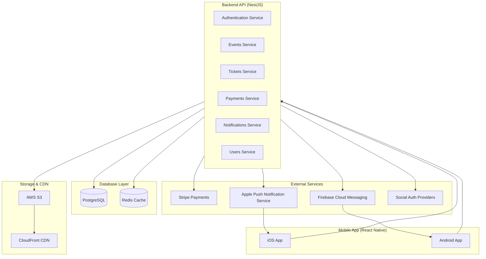
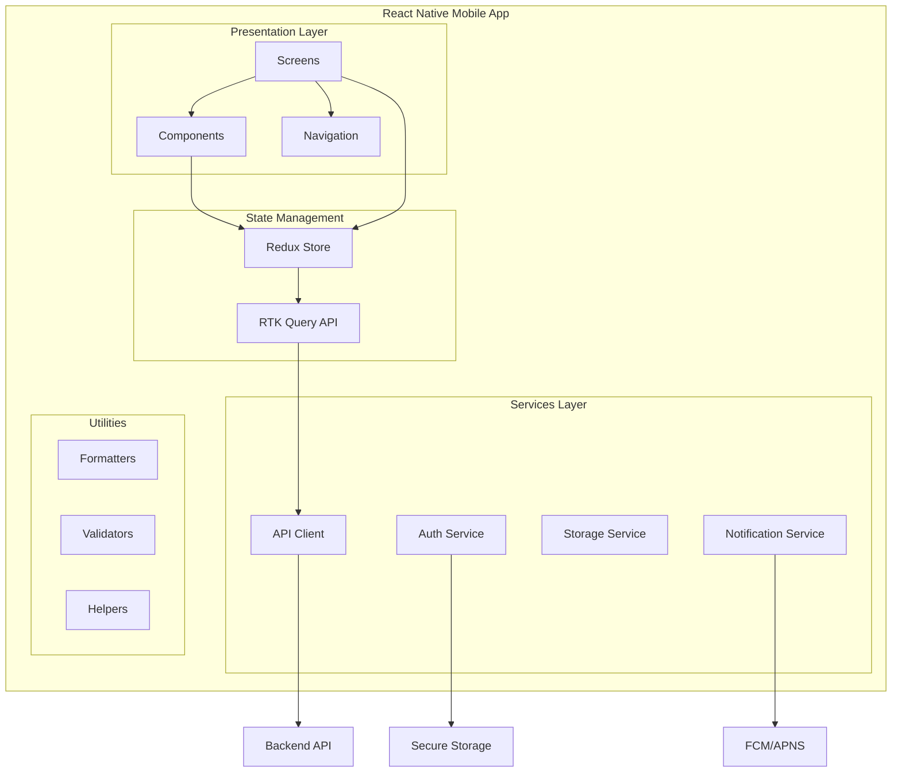
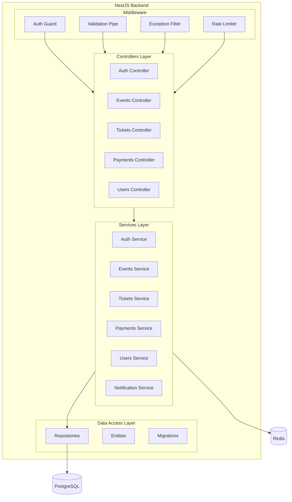
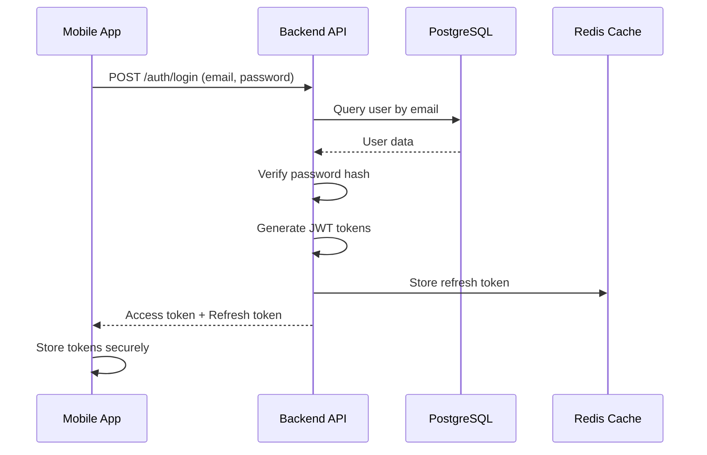
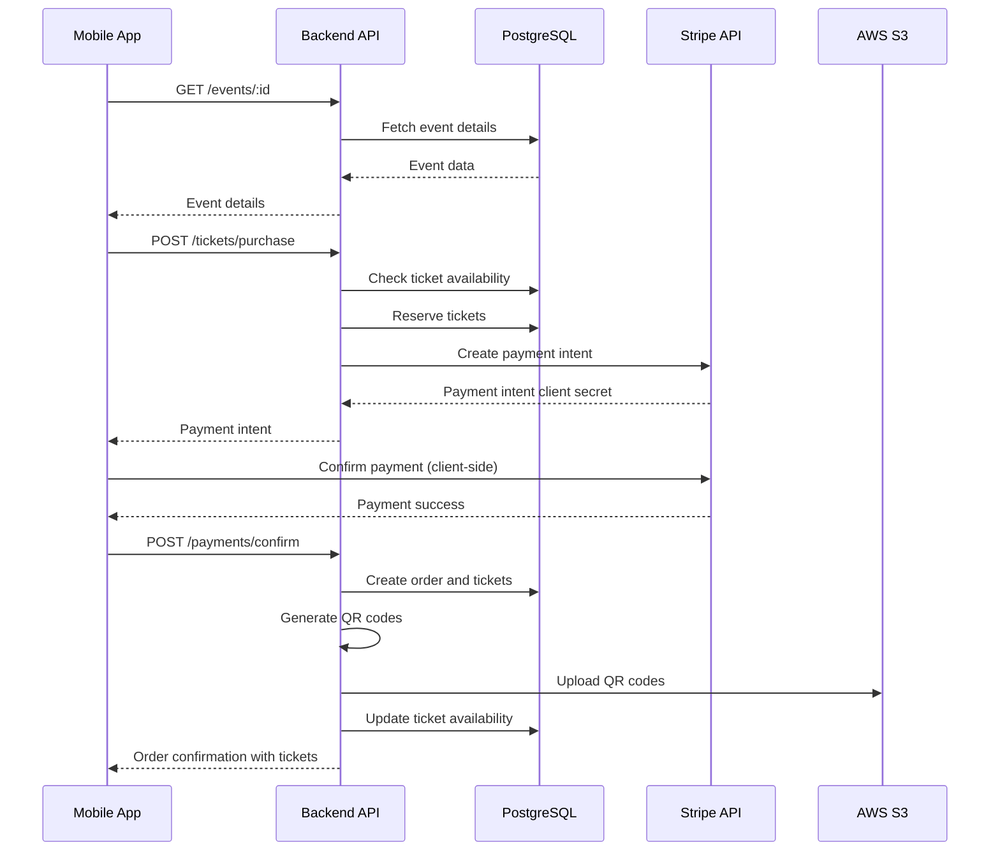
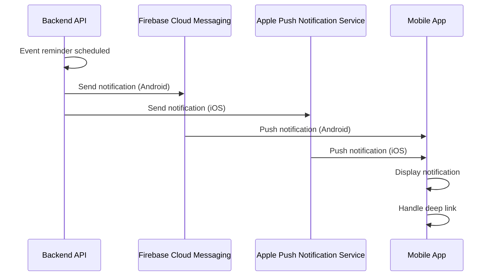
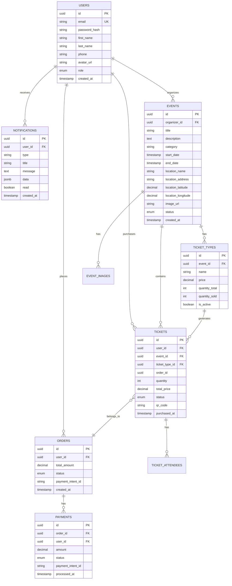
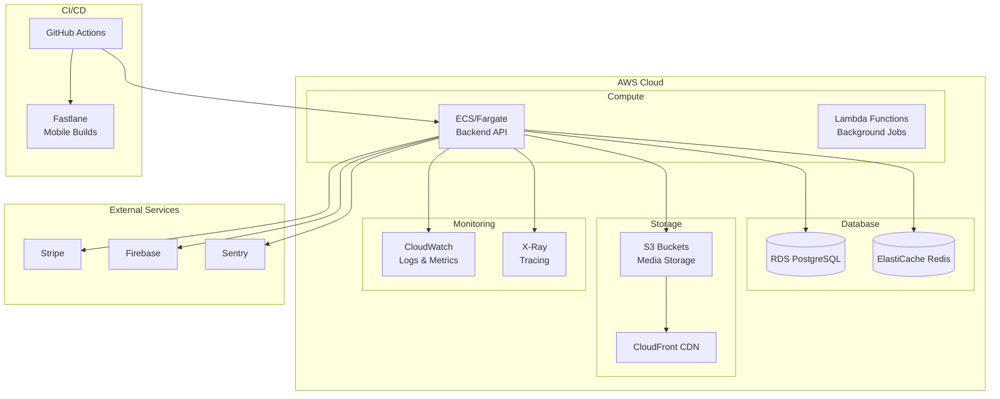
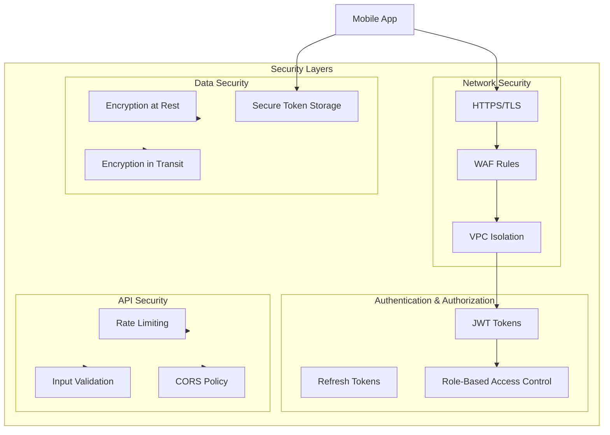

# Fastivalle System Architecture

## Overview

This document describes the system architecture for the Fastivalle mobile application, including the frontend mobile app, backend API, database, and infrastructure components.

## High-Level Architecture

## Component Architecture

### Mobile App Architecture

### Backend API Architecture

## Data Flow Diagrams

### Authentication Flow

### Event Purchase Flow

### Push Notification Flow

## Database Schema Relationships

## Infrastructure Architecture

## Security Architecture

## Deployment Architecture

### Development Environment
- Local PostgreSQL database
- Local Redis instance
- Backend API running locally (port 3000)
- Mobile app connecting to localhost API

### Staging Environment
- AWS ECS Fargate (1 task)
- RDS PostgreSQL (db.t3.micro)
- ElastiCache Redis (cache.t3.micro)
- S3 bucket for media
- CloudFront distribution
- GitHub Actions CI/CD

### Production Environment
- AWS ECS Fargate (auto-scaling, 2-10 tasks)
- RDS PostgreSQL (db.t3.medium, Multi-AZ)
- ElastiCache Redis (cache.t3.medium, cluster mode)
- S3 bucket with versioning
- CloudFront CDN with caching
- AWS WAF for DDoS protection
- Monitoring and alerting

## Technology Stack

### Frontend (Mobile)
- **Framework**: React Native 0.72+
- **Language**: TypeScript 5.0+
- **State Management**: Redux Toolkit + RTK Query
- **Navigation**: React Navigation 6+
- **Styling**: Styled Components
- **Forms**: React Hook Form + Yup
- **HTTP Client**: RTK Query
- **Storage**: AsyncStorage / MMKV
- **Notifications**: React Native Firebase

### Backend
- **Framework**: NestJS 10+
- **Language**: TypeScript 5.0+
- **Database**: PostgreSQL 15+
- **ORM**: TypeORM
- **Cache**: Redis
- **Validation**: class-validator
- **Documentation**: Swagger/OpenAPI
- **Logging**: Winston

### Infrastructure
- **Cloud Provider**: AWS
- **Compute**: ECS Fargate
- **Database**: RDS PostgreSQL
- **Cache**: ElastiCache Redis
- **Storage**: S3 + CloudFront
- **CI/CD**: GitHub Actions
- **Monitoring**: CloudWatch, Sentry
- **Error Tracking**: Sentry

### Third-Party Services
- **Payments**: Stripe
- **Push Notifications**: Firebase Cloud Messaging + APNS
- **Analytics**: Mixpanel/Amplitude
- **Email**: SendGrid/AWS SES

## Scalability Considerations

### Horizontal Scaling
- Backend API can scale horizontally (stateless)
- Database read replicas for read-heavy operations
- Redis cluster for distributed caching
- CDN for static asset delivery

### Vertical Scaling
- Database instance size can be increased
- Redis memory can be increased
- ECS task CPU/memory can be adjusted

### Performance Optimization
- Database query optimization with indexes
- API response caching in Redis
- Image optimization and CDN delivery
- Code splitting in mobile app
- Lazy loading of components

## Disaster Recovery

### Backup Strategy
- Database automated backups (daily, 7-day retention)
- S3 versioning enabled
- Infrastructure as Code (Terraform) for quick recovery

### Recovery Procedures
- Database point-in-time recovery
- Infrastructure recreation from Terraform
- Application deployment from Git repository

## Monitoring & Observability

### Metrics
- API response times
- Error rates
- Database query performance
- Cache hit rates
- Mobile app crash rates
- User engagement metrics

### Logging
- Structured logging (JSON format)
- Centralized log aggregation (CloudWatch)
- Log retention: 30 days

### Alerting
- Error rate thresholds
- Response time thresholds
- Database connection issues
- Payment processing failures
- High memory/CPU usage

---

This architecture is designed to be scalable, maintainable, and secure, supporting the Fastivalle mobile application from MVP through production scale.
